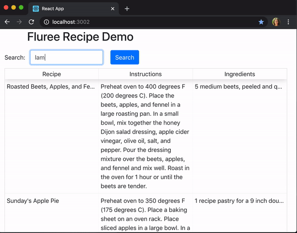
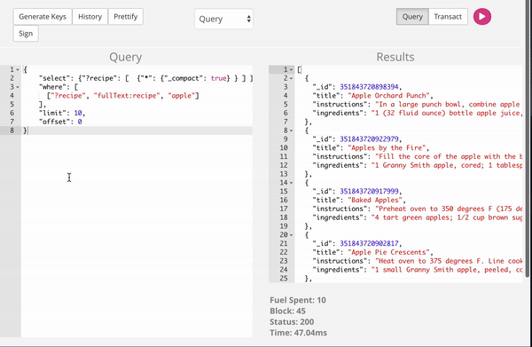

## Fluree Recipe Example

This mini-app uses Fluree's full-text capabilities to quickly through 25,000 recipes.

Features demonstrated: [full-text search](https://docs.flur.ee/docs/database-setup/database-settings#language).



### Get Started

1. `Start Fluree`

Download and unzip this [Fluree packet](https://fluree-examples.s3.amazonaws.com/fluree-recipe-packet.zip). The packet contains Fluree, version 0.13.0, as well as a prepopulated database of recipes. All recipes are taken from [Eight Portions](https://eightportions.com/datasets/Recipes/#fn:1).

Navigate to the folder where you downloaded the packet, and run `./fluree_start.sh`. If you have Java 8+ installed, this should launch Fluree, and a Admin Console will be available for you to explore at `http://localhost:8080`. `resources/example_queries.js` has example queries you can test out directly in the Admin Console.

2. `Start the App`

```
git clone https://github.com/fluree/fluree-recipe-example.git
```

```
cd fluree-recipe-example
```

```
npm install
```

```
npm start
```

### How Does it Work

#### Full-Text Search
Fluree uses Apache Lucene to power our full-text search capabilities. Time-travel is NOT supported in full-text search, so search results only reflect the current Fluree ledger.

Full-text search is set to English, by default. We support [10 different languages](https://docs.flur.ee/docs/database-setup/database-settings#language) in full-text search, including Chinese, Hindi, and Russian. 

In order to enable full-text search on a predicate, `_predicate/fullText` has to be equal to true. For example, `recipe/description` has full-text search enabled:

```
{
    "_id": "_predicate",
    "name": "recipe/description",
    "type": "string",
    "fullText": true
}
```
You can see the full schema in `./resources/schema.json`.

#### Query 

The app is based on a single query:

```
{
    "select":   { "?recipe": [ { "*" : {"_compact":true }}]},
    "where":    [["?recipe","fullText:recipe","apples"]],
    "limit":    10,
    "offset":   0
}
```

The search term (in the example above, `apples`) changes depending on the query, and the `offset` changes to support pagination.

You can try out this and other queries by going to `http://localhost:8080`. `resources/example_queries.js` has example queries you can test out directly in the Admin Console.



### Resources

To see more example projects, visit our [example repo](https://github.com/fluree/examples). 

Check out our entire [documentation](https://docs.flur.ee/) or jump directly to the section on [full-text search](https://docs.flur.ee/docs/database-setup/database-settings#language).

You can also engage with us via email, `support@flur.ee`.

Or by [Slack](https://launchpass.com/flureedb).


